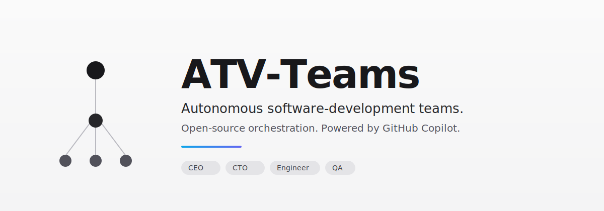

<p align="center">
  
</p>

## What is ATV-Teams?

# Open-source orchestration for human-directed AI teams

**You direct. The agents execute. You approve the spend.**

ATV-Teams is a Node.js server and React UI that lets one person — or a small board — conduct a fleet of AI agents and stay in control of the work, the cost, and the calls that matter. Bring your own agents, set the goal, and run anything from a 2-agent solo project to a company with dozens of agents from one dashboard.

It looks like a task manager — but under the hood it has org charts, budgets, governance, goal alignment, and agent coordination.

**You set the goal. Your AI team gets it done. You stay in the loop.**

|        | Step            | Example                                                                                |
| ------ | --------------- | -------------------------------------------------------------------------------------- |
| **01** | Define the goal | _"Ship our v2 launch in 6 weeks, on schedule and on budget."_                          |
| **02** | Hire the team   | Lead, specialists, reviewers — as few or as many as the goal needs. Any bot, any provider. |
| **03** | Approve and run | Review the plan. Set budgets. Hit go. Monitor and step in from the dashboard.           |

#### Examples of goals

- **Software:** "Ship the v2 launch in 6 weeks, on schedule and on budget."
- **Professional services:** "Run our Q3 client engagement; deliver on the milestone schedule; stay under budget."
- **Individual project:** "Research, draft, edit, and publish my book over the next 12 weeks."

Same control plane in every case.

<br/>

> **Copilot-first:** ATV-Teams is focused on GitHub Copilot-powered agent teams. Copilot does the execution; ATV-Teams gives the work structure, budgets, heartbeats, approvals, and a human board.

<br/>

<div align="center">
<table>
  <tr>
    <td align="center"><strong>Built<br/>around</strong></td>
    <td align="center">🤖<br/><sub>GitHub Copilot</sub></td>
    <td align="center">🗂️<br/><sub>Repo workspaces</sub></td>
    <td align="center">💓<br/><sub>Heartbeats</sub></td>
    <td align="center">✅<br/><sub>Board approvals</sub></td>
  </tr>
</table>

<em>Copilot executes. Humans direct, approve, and govern.</em>

</div>

<br/>

## ATV-Teams is right for you if

- ✅ You want to **conduct a team of AI agents** — from a 2-agent solo project to a company-wide org
- ✅ You **coordinate GitHub Copilot agents** toward a common goal
- ✅ You're juggling **multiple Copilot tasks, chats, or sessions** and lose track of who's working on what
- ✅ You want agents running **24/7 against goals you set**, with you in the loop to review work and approve spend
- ✅ You want to **monitor costs** and enforce budgets per agent and per project
- ✅ Your work is **software, professional services, or a personal project** — the control plane is the same
- ✅ You want a process for managing agents that **feels like using a task manager**
- ✅ You want **private browser access** to the dashboard when you're away from your desk

<br/>

## Features

<table>
<tr>
<td align="center" width="33%">
<h3>🤖 Copilot-First Teams</h3>
GitHub Copilot-powered agents work from one org chart, with roles, goals, budgets, and approval gates.
</td>
<td align="center" width="33%">
<h3>🎯 Goal Alignment</h3>
Every task traces back to the company mission. Agents know <em>what</em> to do and <em>why</em>.
</td>
<td align="center" width="33%">
<h3>💓 Heartbeats</h3>
Agents wake on a schedule, check work, and act. Delegation flows up and down the org chart.
</td>
</tr>
<tr>
<td align="center">
<h3>💰 Cost Control</h3>
Monthly budgets per agent. When they hit the limit, they stop. No runaway costs.
</td>
<td align="center">
<h3>🏢 Multi-Company</h3>
One deployment, many companies. Complete data isolation. One control plane for your portfolio.
</td>
<td align="center">
<h3>🎫 Ticket System</h3>
Every conversation traced. Every decision explained. Full tool-call tracing and immutable audit log.
</td>
</tr>
<tr>
<td align="center">
<h3>🛡️ Governance</h3>
You're the board. Approve hires, override strategy, pause or terminate any agent — at any time.
</td>
<td align="center">
<h3>📊 Org Chart</h3>
Hierarchies, roles, reporting lines. Your agents have a boss, a title, and a job description.
</td>
<td align="center">
<h3>🌐 Private Browser Access</h3>
Run it locally or over your private network/tailnet so you can check the dashboard away from your main machine.
</td>
</tr>
</table>

<br/>

## Problems ATV-Teams solves

| Without ATV-Teams                                                                                                                     | With ATV-Teams                                                                                                                         |
| ------------------------------------------------------------------------------------------------------------------------------------- | -------------------------------------------------------------------------------------------------------------------------------------- |
| ❌ You have multiple Copilot chats and tasks open and can't track which one does what. On reboot you lose everything.                 | ✅ Tasks are ticket-based, conversations are threaded, sessions persist across reboots.                                                |
| ❌ You manually gather context from several places to remind your bot what you're actually doing.                                     | ✅ Context flows from the task up through the project and company goals — your agent always knows what to do and why.                  |
| ❌ Folders of agent configs are disorganized and you're re-inventing task management, communication, and coordination between agents. | ✅ ATV-Teams gives you org charts, ticketing, delegation, and governance out of the box — so you run a company, not a pile of scripts. |
| ❌ Runaway loops waste hundreds of dollars of tokens and max your quota before you even know what happened.                           | ✅ Cost tracking surfaces token budgets and throttles agents when they're out. Management prioritizes with budgets.                    |
| ❌ You have recurring jobs (customer support, social, reports) and have to remember to manually kick them off.                        | ✅ Heartbeats handle regular work on a schedule. Management supervises.                                                                |
| ❌ You have an idea, you have to find your repo, open a one-off Copilot session, and babysit it.                                      | ✅ Add a task in ATV-Teams. Your Copilot-powered agent works on it until it's done. Management reviews the work.                       |

<br/>

## Why ATV-Teams is special

ATV-Teams handles the hard orchestration details correctly.

|                                   |                                                                                                               |
| --------------------------------- | ------------------------------------------------------------------------------------------------------------- |
| **Atomic execution.**             | Task checkout and budget enforcement are atomic, so no double-work and no runaway spend.                      |
| **Persistent agent state.**       | Agents resume the same task context across heartbeats instead of restarting from scratch.                     |
| **Runtime skill injection.**      | Agents can learn ATV-Teams workflows and project context at runtime, without retraining.                      |
| **Governance with rollback.**     | Approval gates are enforced, config changes are revisioned, and bad changes can be rolled back safely.        |
| **Goal-aware execution.**         | Tasks carry full goal ancestry so agents consistently see the "why," not just a title.                        |
| **Portable company templates.**   | Export/import orgs, agents, and skills with secret scrubbing and collision handling.                          |
| **True multi-company isolation.** | Every entity is company-scoped, so one deployment can run many companies with separate data and audit trails. |

<br/>

## What's Under the Hood

ATV-Teams is a full control plane, not a wrapper. Before you build any of this yourself, know that it already exists:

```
┌──────────────────────────────────────────────────────────────┐
│                      ATV-TEAMS  SERVER                       │
│                                                              │
│  ┌───────────┐  ┌───────────┐  ┌───────────┐  ┌───────────┐  │
│  │Identity & │  │  Work &   │  │ Heartbeat │  │Governance │  │
│  │  Access   │  │   Tasks   │  │ Execution │  │& Approvals│  │
│  └───────────┘  └───────────┘  └───────────┘  └───────────┘  │
│                                                              │
│  ┌───────────┐  ┌───────────┐  ┌───────────┐  ┌───────────┐  │
│  │ Org Chart │  │Workspaces │  │  Plugins  │  │  Budget   │  │
│  │ & Agents  │  │ & Runtime │  │           │  │ & Costs   │  │
│  └───────────┘  └───────────┘  └───────────┘  └───────────┘  │
│                                                              │
│  ┌───────────┐  ┌───────────┐  ┌───────────┐  ┌───────────┐  │
│  │ Routines  │  │ Secrets & │  │ Activity  │  │  Company  │  │
│  │& Schedules│  │  Storage  │  │ & Events  │  │Portability│  │
│  └───────────┘  └───────────┘  └───────────┘  └───────────┘  │
└──────────────────────────────────────────────────────────────┘
         ▲              ▲              ▲              ▲
   ┌─────┴─────┐  ┌─────┴─────┐  ┌─────┴─────┐  ┌─────┴─────┐
   │ GitHub   │  │ Sandbox   │  │  Repo     │  │ Board &   │
   │ Copilot  │  │workspaces │  │ sessions  │  │ approvals │
   └───────────┘  └───────────┘  └───────────┘  └───────────┘
```

### The Systems

<table>
<tr>
<td width="50%">

**Identity & Access** — Two deployment modes (trusted local or authenticated), board users, agent API keys, short-lived run JWTs, company memberships, invite flows, and Copilot run authorization. Every mutating request is traced to an actor.

</td>
<td width="50%">

**Org Chart & Agents** — Copilot-powered agents have roles, titles, reporting lines, permissions, and budgets. ATV-Teams coordinates their work through heartbeats, repo workspaces, task context, and human approval gates.

</td>
</tr>
<tr>
<td>

**Work & Task System** — Issues carry company/project/goal/parent links, atomic checkout with execution locks, first-class blocker dependencies, comments, documents, attachments, work products, labels, and inbox state. No double-work, no lost context.

</td>
<td>

**Heartbeat Execution** — DB-backed wakeup queue with coalescing, budget checks, workspace resolution, secret injection, skill loading, and adapter invocation. Runs produce structured logs, cost events, session state, and audit trails. Recovery handles orphaned runs automatically.

</td>
</tr>
<tr>
<td>

**Workspaces & Runtime** — Project workspaces, isolated execution workspaces (git worktrees, operator branches), and runtime services (dev servers, preview URLs). Agents work in the right directory with the right context every time.

</td>
<td>

**Governance & Approvals** — Board approval workflows, execution policies with review/approval stages, decision tracking, budget hard-stops, agent pause/resume/terminate, and full audit logging. You're the board — nothing ships without your sign-off.

</td>
</tr>
<tr>
<td>

**Budget & Cost Control** — Token and cost tracking by company, agent, project, goal, issue, provider, and model. Scoped budget policies with warning thresholds and hard stops. Overspend pauses agents and cancels queued work automatically.

</td>
<td>

**Routines & Schedules** — Recurring tasks with cron, webhook, and API triggers. Concurrency and catch-up policies. Each routine execution creates a tracked issue and wakes the assigned agent — no manual kick-offs needed.

</td>
</tr>
<tr>
<td>

**Plugins** — Instance-wide plugin system with out-of-process workers, capability-gated host services, job scheduling, tool exposure, and UI contributions. Extend ATV-Teams without forking it.

</td>
<td>

**Secrets & Storage** — Instance and company secrets, encrypted local storage, provider-backed object storage, attachments, and work products. Sensitive values stay out of prompts unless a scoped run explicitly needs them.

</td>
</tr>
<tr>
<td>

**Activity & Events** — Mutating actions, heartbeat state changes, cost events, approvals, comments, and work products are recorded as durable activity so operators can audit what happened and why.

</td>
<td>

**Company Portability** — Export and import entire organizations — agents, skills, projects, routines, and issues — with secret scrubbing and collision handling. One deployment, many companies, complete data isolation.

</td>
</tr>
</table>

<br/>

## What ATV-Teams is not

|                              |                                                                                                                      |
| ---------------------------- | -------------------------------------------------------------------------------------------------------------------- |
| **Not a chatbot.**           | Agents have jobs, not chat windows.                                                                                  |
| **Not an agent framework.**  | We don't tell you how to build agents. We tell you how to run a company made of them.                                |
| **Not a workflow builder.**  | No drag-and-drop pipelines. ATV-Teams models companies — with org charts, goals, budgets, and governance.            |
| **Not a prompt manager.**    | Agents bring their own prompts, models, and runtimes. ATV-Teams manages the organization they work in.               |
| **Not a single-agent tool.** | This is for teams. If you have one agent, you probably don't need ATV-Teams. From a 2-agent solo project to a company with dozens of agents, the control plane is the same. |
| **Not a code review tool.**  | ATV-Teams orchestrates work, not pull requests. Bring your own review process.                                       |

<br/>

## Quickstart

Open source. Self-hosted. No account required.

```bash
npx paperclipai onboard --yes
```

> **Note:** The CLI binary is still named `paperclipai` (kept for back-compat with the upstream install path). The product itself is ATV-Teams.

That quickstart path defaults to trusted local loopback mode for the fastest first run. To start in authenticated/private mode instead, choose a bind preset explicitly:

```bash
npx paperclipai onboard --yes --bind lan
# or:
npx paperclipai onboard --yes --bind tailnet
```

If you already have ATV-Teams configured, rerunning `onboard` keeps the existing config in place. Use `paperclipai configure` to edit settings.

Or manually:

```bash
git clone https://github.com/shyamsridhar123/ATV-Teams.git
cd ATV-Teams
pnpm install
pnpm dev
```

This starts the API server at `http://localhost:3100`. An embedded PostgreSQL database is created automatically — no setup required.

> **Requirements:** Node.js 20+, pnpm 9.15+

<br/>

## FAQ

**What does a typical setup look like?**
Locally, a single Node.js process manages an embedded Postgres and local file storage. For production, point it at your own Postgres and deploy however you like. Configure projects, agents, and goals — the agents take care of the rest.

If you're a solo-entrepreneur you can use Tailscale to access ATV-Teams on the go. Then later you can deploy to e.g. Vercel when you need it.

**Can I run multiple companies?**
Yes. A single deployment can run an unlimited number of companies with complete data isolation.

**How is ATV-Teams different from GitHub Copilot by itself?**
Copilot is the executor. ATV-Teams is the control plane around it — org charts, goals, budgets, task context, heartbeats, governance, and accountability.

**Why should I use ATV-Teams instead of just tracking Copilot work in GitHub Issues or a project board?**
Agent orchestration has subtleties in how you coordinate who has work checked out, how to preserve run context, monitor cost, and enforce governance — ATV-Teams does this for you.

(Bring-your-own-ticket-system is on the Roadmap)

**Do agents run continuously?**
By default, Copilot-powered agents run on scheduled heartbeats and event-based triggers (task assignment, @-mentions). ATV-Teams coordinates the timing, context, budget, and approval gates.

<br/>

## Development

```bash
pnpm dev              # Full dev (API + UI, watch mode)
pnpm dev:once         # Full dev without file watching
pnpm dev:server       # Server only
pnpm build            # Build all
pnpm typecheck        # Type checking
pnpm test             # Cheap default test run (Vitest only)
pnpm test:watch       # Vitest watch mode
pnpm test:e2e         # Playwright browser suite
pnpm db:generate      # Generate DB migration
pnpm db:migrate       # Apply migrations
```

`pnpm test` does not run Playwright. Browser suites stay separate and are typically run only when working on those flows or in CI.

See [doc/DEVELOPING.md](doc/DEVELOPING.md) for the full development guide.

<br/>

## Roadmap

- ✅ Plugin system (e.g. add a knowledge base, custom tracing, queues, etc)
- ✅ GitHub Copilot agent employees
- ✅ companies.sh - import and export entire organizations
- ✅ Easy AGENTS.md configurations
- ✅ Skills Manager
- ✅ Scheduled Routines
- ✅ Better Budgeting
- ✅ Agent Reviews and Approvals
- ✅ Multiple Human Users
- ⚪ Cloud / Sandbox Copilot agents
- ⚪ Artifacts & Work Products
- ⚪ Mobile-first operator view
- ⚪ Memory / Knowledge
- ⚪ Enforced Outcomes
- ⚪ MAXIMIZER MODE
- ⚪ Deep Planning
- ⚪ Work Queues
- ⚪ Self-Organization
- ⚪ Automatic Organizational Learning
- ⚪ CEO Chat
- ⚪ Cloud deployments
- ⚪ Desktop App

This is the short roadmap preview. See the full roadmap in [ROADMAP.md](ROADMAP.md).

<br/>

## Telemetry

ATV-Teams inherits the upstream ATV-Teams anonymous usage telemetry to help understand how the product is used and improve it. No personal information, issue content, prompts, file paths, or secrets are ever collected. Private repository references are hashed with a per-install salt before being sent.

Telemetry is **enabled by default** and can be disabled with any of the following:

| Method               | How                                                     |
| -------------------- | ------------------------------------------------------- |
| Environment variable | `PAPERCLIP_TELEMETRY_DISABLED=1`                        |
| Standard convention  | `DO_NOT_TRACK=1`                                        |
| CI environments      | Automatically disabled when `CI=true`                   |
| Config file          | Set `telemetry.enabled: false` in your config           |

## Contributing

We welcome contributions. See the [contributing guide](CONTRIBUTING.md) for details.

<br/>

## Community

- [GitHub Issues](https://github.com/shyamsridhar123/ATV-Teams/issues) — bugs and feature requests
- [GitHub Discussions](https://github.com/shyamsridhar123/ATV-Teams/discussions) — ideas and RFC

<br/>

## Acknowledgements

ATV-Teams is built on the open-source [Paperclip](https://github.com/paperclipai/paperclip) control plane. Internal package names (`@paperclipai/*`), the `paperclipai` CLI binary, and the `~/.paperclip/` config directory are preserved for compatibility with the upstream install path.

## License

MIT &copy; 2026 ATV-Teams contributors. Portions © ATV-Teams contributors under MIT.

---

<p align="center">
  <sub>Open source under MIT. Built for human-directed AI teams. Powered by GitHub Copilot.</sub>
</p>
